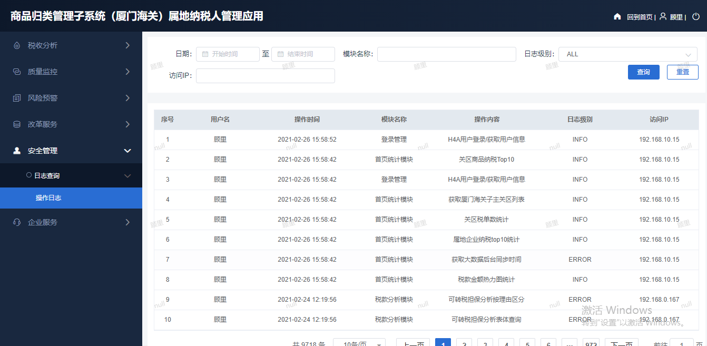

# 日志系统设计

  2021-3-9 |    彭涛

本文档简要介绍日志系统设计方案

> 预览如下

### 需求介绍
#####  随着业务的不断发展，多个系统需要日志审计功能，系统变得复杂而且庞大，由此带来几个明显的系统问题：

- 复杂性高：随着业务的不断发展，单个系统的代码量越来越多，各个系统如果都复制插入日志代码，代码的可读性，可维护性，可扩展性不高。

- 可复用性差：各个系统需要接入审计日志功能只能复制代码。

- 扩展性低：只能对整个应用进行横向扩展，不能针对具体的业务子系统进行扩展，不够灵活。

  

#####  基于以上背景，我们需要把日志模块单独拆分成基础系统，服务模块化:

1. 实现可供业务查询的操作日志
2. 日志记录格式规范设计
3. 处理流程设计（异步、入库、详细字段等）
4. 集成方案设计（简单易操作）

### 需求分析

针对以上需求，详细的需求分析如下，该模块应该达到以下要求

    性能：用户正常访问时无明显延迟。
    
    成本：成本主要有开发成本、维护成本，升级成本等。
    
    时间：待定。
    
    可靠性：系统可靠性达到99.99%。
    
    安全性：暴露的日志服务接口要保证安全性。
    
    合规性：按照公司的编码规范进行开发。
    
    技术性：目前团队主要研发人员是Java，用Java开发。
    
    兼容性：之前没有类似系统，无需考虑兼容性。
    
    可用性：保证系统的可用性，提供不间断的服务。
    
    高性能：能够支撑现阶段接入各个系统用户正常的访问
    
    可扩展：保留接口，针对具体的业务系统的需求可进行扩展
    

### 备选方案

**备选方案1：传统方式**
    采用传统的关系型数据库方案，服务跟随系统jar包启动，数据存放在MySQL等数据库。

**按月分表** ，jdbcTemplate，单独数据源datebase

**备选方案2：文档型数据库**
   文档型数据库方案

**备选方案3：消息队列、搜索引擎**
   搜索引擎方案复杂度过高，现阶段不考虑

## 架构设计

前期采用备选方案1

### 总体方案

owinfo-log-starter 启动器

owinfo-log-core 日志收集

owinfo-log-annotation 注解支持

owinfo-log-sevice 日志入库和查询

 

### 详细设计

保证服务开箱即用，直接引入owinfo-log-starter依赖无需多余步骤即可使用，支持扩展。

默认情况下，使用业务系统默认数据源，自动创建表结构，不对外暴露接口，须手动开启。

##### 权限认证：提供接口供业务系统自定义实现

##### 日志内容：默认提供注解方式（支持SPEL表达式），并提供手动调用备用方式

##### 接口：统一暴露 `/api/log/**` 路径，提供查询接口，~~删除接口~~，接口展示字段可自定义

##### 储存：由 owinfo-log-sevice 封装所有持久化相关操作，对其他模块暴露接口即可

#### 日志规范设计

​    后续提供

#### 安全设计
    严禁将服务的接口不经登录暴露到公网
    对敏感信息的需要加密后在进行传输
    禁止接口返回敏感的数据，且不返回无用的多余的信息
    最小依赖原则，尽量不引入多余依赖

#### 其他设计

​     严格按照编码规范编码，优化代码，合理利用缓存，优化数据库结构，优化表结构，优化查询语句，采用异步，读写分离的方法等方面进行设计优化。提高服务的吞吐量

### 架构演进规划

由于时间的因素，架构演进可分期进行：

第一期：实现基本功能，满足现阶段需求。

第二期：根据情况对系统进行改进

